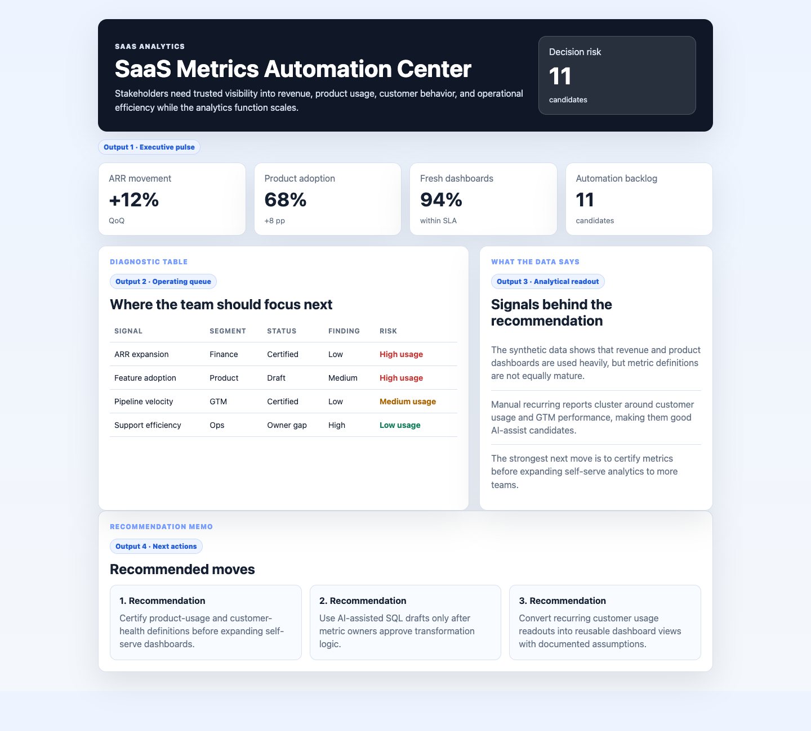

# SaaS Metrics Automation Center

I built this because modern SaaS analytics teams need more than dashboards. They need consistent metric definitions, reliable modeled data, AI-assisted workflow triage, and self-serve views that help GTM, product, finance, and operations move faster without creating metric drift.



## Why this exists

Stakeholders need trusted visibility into revenue, product usage, customer behavior, and operational efficiency while the analytics function scales.

## What is in the project

- A polished dashboard in `index.html`
- Modular UI/data files in `src/`
- Synthetic operating data in `data/synthetic_operating_data.csv`
- A screenshot captured from the rendered app in `docs/images/dashboard.png`

## Dashboard sections

- Metric pulse: ARR movement, product adoption, dashboard freshness, and anomaly count.
- Data model view: Snowflake-style metric definitions, owner gaps, and dbt-ready checks.
- Automation memo: AI-assisted reporting opportunities and self-serve analytics priorities.

## What the data says

The synthetic data shows that revenue and product dashboards are used heavily, but metric definitions are not equally mature.

Manual recurring reports cluster around customer usage and GTM performance, making them good AI-assist candidates.

The strongest next move is to certify metrics before expanding self-serve analytics to more teams.

## Output walkthrough

### Output 1: Executive pulse

The KPI cards summarize the current operating picture and highlight whether the team should trust, investigate, or act on the latest metrics.

### Output 2: Diagnostic table

The table converts raw operating signals into a ranked queue of risks, owners, and recommended next actions.

### Output 3: Analytical recommendations

The memo turns the analysis into specific business actions that can be discussed in a weekly review or stakeholder workshop.

## Run locally

```bash
python3 -m http.server 4173
```

Then open `http://localhost:4173`.
