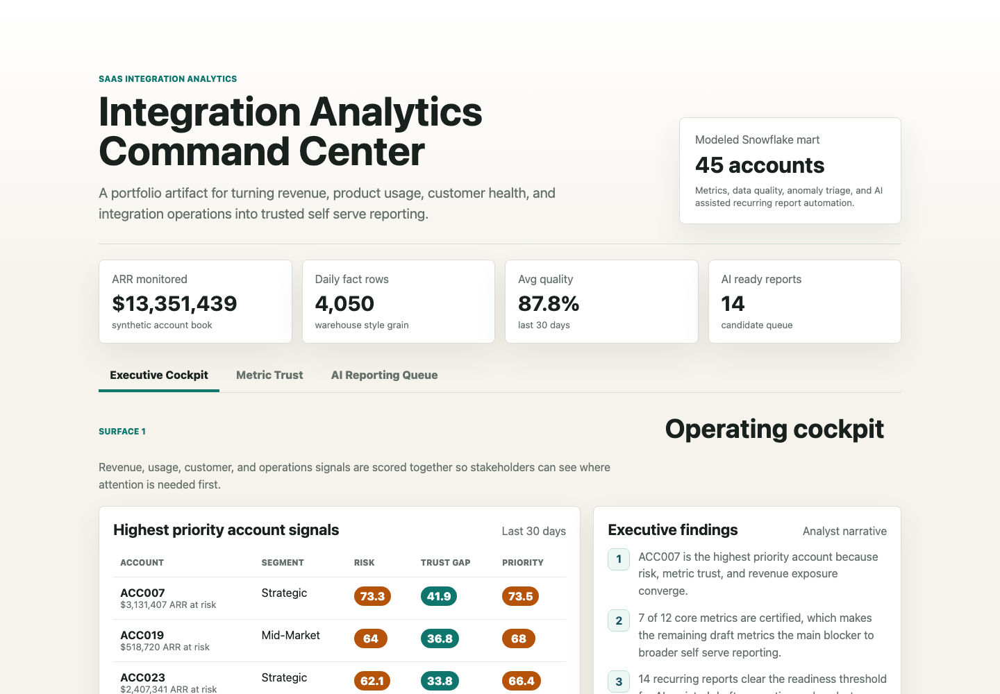
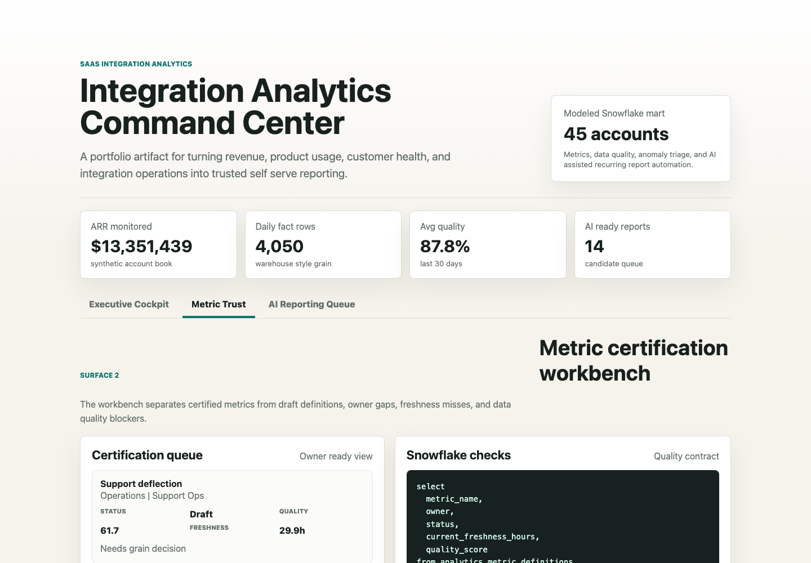
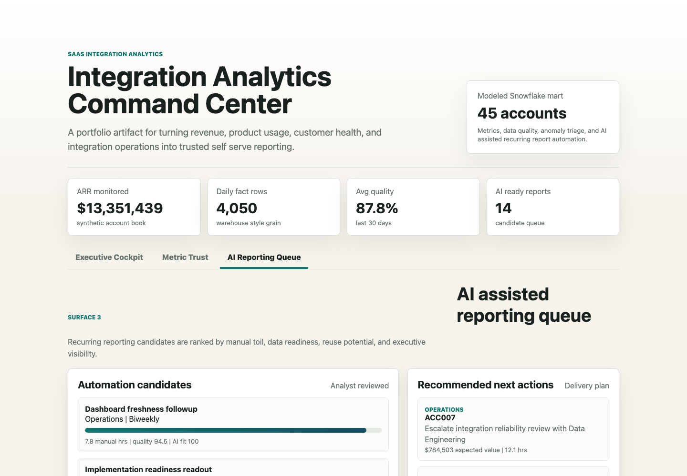

# Integration Analytics Command Center

A data analyst portfolio artifact for a SaaS integration and automation platform that needs trusted self serve reporting across revenue, product usage, customer health, and operations.

The project models the work behind a strong BI function: define metrics, validate data quality, identify account level risks, rank recurring reporting automation candidates, and explain the next action in plain business language.

## Screenshots



Caption: The executive cockpit combines revenue exposure, product usage, customer friction, integration reliability, and metric trust into one priority queue.



Caption: The metric trust surface shows which KPI definitions are certified, which have owner or freshness gaps, and the Snowflake style checks an analyst would use before scaling self serve reporting.



Caption: The automation queue ranks recurring stakeholder reports by manual toil, dashboard reuse, data quality, executive visibility, and AI assist fit.

## What this project includes

- A three surface browser artifact built with static HTML, CSS, and JavaScript.
- A reproducible synthetic data generator in `scripts/score_operating_data.py`.
- Synthetic account, daily metric, source event, metric definition, reporting request, and action datasets.
- Scored outputs for account priority, metric certification, and reporting automation readiness.
- Snowflake style SQL checks in `analysis/sql_checks.sql`.
- Executive findings, an analysis plan, and a data dictionary for interview preparation.

## Data

All data is synthetic and generated locally. It does not represent real customer or company performance.

The generator creates 45 synthetic accounts across SMB, mid-market, enterprise, and strategic segments. ARR, active integration flows, daily run volume, dashboard usage, product usage, support friction, data quality, metric freshness, and certified metric coverage are modeled from related distributions so that the signals move in realistic ways.

The synthetic structure is modeled on common SaaS integration analytics patterns:

- Larger segments have higher ARR, more active integration flows, and more daily executions.
- Reliability issues raise error rate, support tickets, freshness delay, and ARR at risk.
- Product adoption increases usage depth and expansion signal.
- Metric governance includes certified, draft, and owner gap states.
- Recurring reporting requests include manual hours, dashboard reuse, data quality, executive visibility, and AI assist fit.

The generated datasets live in `data/`, and the scored outputs live in `analysis/outputs/`.

## What this demonstrates

This artifact is designed for a data analyst or BI role in a SaaS environment. It demonstrates SQL oriented analytical thinking, dashboard and self serve reporting design, metric definition governance, data quality validation, proactive anomaly triage, and responsible use of AI assisted automation.

The goal is not to show one polished KPI page. The goal is to show the full insight delivery lifecycle from ambiguous stakeholder question to governed metric, working dashboard, ranked analysis, and operational recommendation.

## Scope

What it does:

- Scores accounts by operational risk, revenue opportunity, and metric trust gap.
- Highlights metric definitions that need ownership, quality, or freshness fixes.
- Ranks recurring reports that are good candidates for AI assisted drafting and analyst review.
- Documents the synthetic data strategy and SQL validation approach.

What it does not do:

- It does not connect to a live warehouse.
- It does not claim to represent real customer, account, or company performance.
- It does not automate stakeholder communication or publish reports.

## Run locally

```bash
npm run analyze
npm run start
```

Then open `http://localhost:4173/`.
